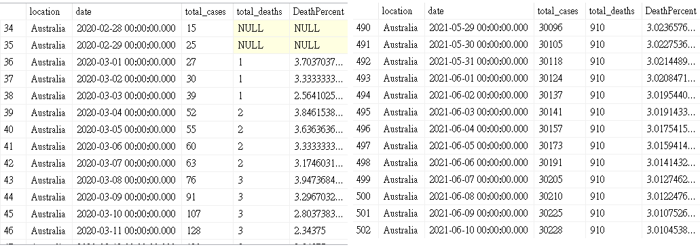
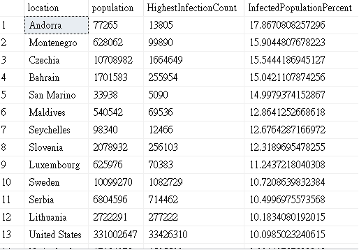
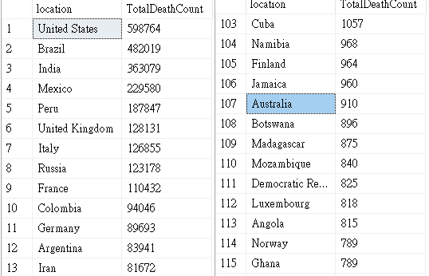
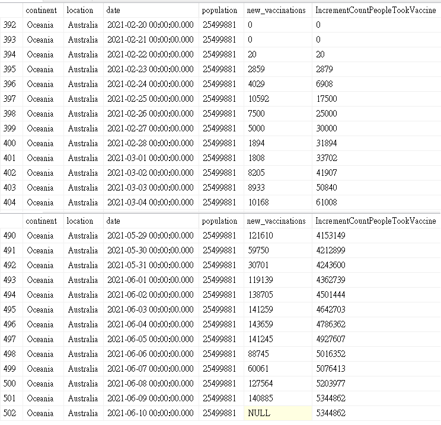

# Project 1 - Covid Case Analysis

 

**Project Summary:** Analyze global Covid case data to discover insights and visulze the finding.  

**Task Involved:** Data Exploration, Data Visualization

**Tools Used:** SQL, Tableau

 

## Data Summary and Preparation

- The dataset used in this project is the **Coronavirus (COVID-19) Deaths** which collected by **Our World in Data.**

- The duration of the dataset period is between **24/2/2020 - 10/6/2021**

- There are **60 columns** and **94857** observations.

- The dataset has been separated into two two datasets with relevant columns, **CovidDeath** and **CovidVaccination**

 

## Data Exploration

**The following exploration has been conducted by using Microsoft SQL Server. For more inforamtion and comment, please refer to the SQL query file.**

 

First, let's have a look at the total cases vs total deaths in Australia 

**Insight ONE**. The first death case in Austrlaia is on the 1st March 2020. Total cases were increasing but death percent remains stable around 3% since 10 Sep 2020.

 

Then, let's have a look at the total Cases vs population infected in Australia

**Insight TWO**. The population of AU is around 2549881, the highest percentage of the people who got tested and confirmed covid is 9.8% which is on the 29 Feb 2020. After that, it has been dropped to 0.1% which showing that the Lock down and the quarantine control is doing a good job.

 

After that, let's now have a look which counties has the highest Infction Rate compared to Population.

**Insight THREE**. The top 10 countries has a certain small population. US is on ranking 13 which as a 10% infection rate and AU is on ranking 168 which has 0.11% infection rate.

 

Then, let's have a look at the counties with Highest Death count.

**Insight FOUR**. US has the highest total death count, followed by brazil and India. AU only has 910 death count.

 

Finally, let's now look at the total Population vs Vaccinations in Australia

**Insight FIVE**. The first vaccine taken in AU is on the 2-22-2020, and 5344862 of vaccinations has been applied by the end of 10-06-2021. 

 

## Data Visualization

I have changed little bit of the code as to visulize the data as in Global.

Link to my Tableau Dashboard

**PUT PICTURE 7**

- The cross tab shows the global covid cases and death count.

- The bar chat shows the total death count by Continent.

- The geo map shows the infected population distribution. 

- The time series graph shows the infected trand for the top 8 counties followed by a forcasting analysis. 

